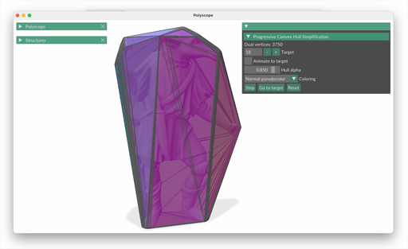

# Progressive Convex Hull Simplification



## What it does

Given a 3D mesh, produces a sequence of progressively simpler convex hulls that are guaranteed to strictly contain the input at every step (conservative / exterior simplification).

The key idea is to work in the *dual* of the convex hull. Removing a vertex from the dual corresponds to removing a halfspace from the primal hull's H-representation — i.e., eliminating one face constraint and slightly enlarging the hull. Dual vertices are removed greedily in order of the primal volume added (analogous to quadric-error simplification for triangle meshes).

## Build

Requires CMake ≥ 3.16 and a C++17 compiler. Dependencies are fetched automatically via FetchContent.

```bash
# Full build (includes interactive viewer; polyscope + embree fetched automatically)
cmake -B build -DCMAKE_BUILD_TYPE=RelWithDebInfo
cmake --build build --target pchs

# Headless build (no polyscope or embree dependency)
cmake -B build-headless -DCMAKE_BUILD_TYPE=RelWithDebInfo -DPCHS_INTERACTIVE=OFF
cmake --build build-headless --target pchs

# Python bindings (nanobind fetched automatically; pass your Python executable)
cmake -B build-py -DCMAKE_BUILD_TYPE=RelWithDebInfo -DPCHS_INTERACTIVE=OFF -DPCHS_PYTHON_BINDINGS=ON \
      -DPython_EXECUTABLE=$(python3 -c "import sys; print(sys.executable)")
cmake --build build-py --target pchs_python_module
```

## Usage

```
./build/pchs [options] [mesh.ply]
```

Defaults to an icosahedron if no mesh is given.

| Option | Description |
|---|---|
| `--target N` | Simplify to N dual vertices / halfspaces (default: 18) |
| `--primal-output file.ply` | Write simplified hull as a polygon PLY (default: `<stem>-primal.ply`) |
| `--dual-output file` | Write simplified dual as a triangle mesh in any format igl supports (default: `<stem>-dual.ply`) |
| `--interactive` | Open a viewer (see below; requires `PCHS_INTERACTIVE=ON` build) |
| `--stats` | Print per-phase timing after simplification |

In non-interactive mode the primal (polygon mesh) and dual (triangle mesh) outputs are written to files. Default filenames are derived from the input filename stem, e.g. `Actaeon.ply` → `Actaeon-primal.ply` and `Actaeon-dual.ply`.

### Interactive viewer

```bash
./build/pchs --interactive --target 18 Actaeon.ply
```

Opens a [polyscope](https://polyscope.run) window showing the input mesh (with ambient occlusion, computed in the background) and the current simplified hull (transparent, colored by face normals or graph coloring). Controls are in the left panel under **Hull Simplification**: step one vertex at a time, animate to the target count, adjust hull transparency, switch coloring mode, or reset to the full hull.

## Algorithm sketch

1. Compute the convex hull of the input primal mesh (CGAL).
2. Find the Chebyshev center of the primal halfspaces via a small linear program (SDLP).
3. Map each non-(nearly-)degenerate primal face to a dual vertex via the polarity transform about the Chebyshev center.
4. Compute the convex hull of the dual points (CGAL).
5. For each dual vertex, measure the cost of removing it and re-triangulating convexly locally: the primal volume that would be added to the hull (`primal_volume_subtended`).
6. Maintain a lazy-deletion min-heap. Repeatedly pop the cheapest vertex, erase it from the dual (retriangulating the resulting hole convexly), and update neighbors' costs.
7. Convert the simplified dual back to a primal polygon mesh.

## Library API

The core logic is in `ConvexHullSimplification` (`convex_hull_simplification.h`):

```cpp
ConvexHullSimplification chs(V, F);   // build primal hull, dual, init queue
chs.simplify_to(18);                  // greedily simplify to 18 dual vertices
auto [pV, pPI, pPC] = chs.get_primal_mesh();  // get current hull as polygon mesh
```

For step-by-step control:

```cpp
while(chs.step()) { ... }             // one greedy removal per call
chs.num_dual_vertices();              // current vertex count
chs.stats();                          // timing breakdown (t_primal_hull, t_dual_hull,
                                      //   t_queue_init, t_last_simplify)
```

`MAX_DEGREE_FOR_FLIPS` (env var, default 100) controls the vertex-degree threshold above which the convex-hull-based one-ring triangulation is used instead of the flip-based method.

## Python API

After building with `-DPCHS_PYTHON_BINDINGS=ON`, add the build directory to `PYTHONPATH` and import `pchs`:

```python
import pchs
import numpy as np
import igl

V, F = igl.icosahedron()  # or load your own mesh with igl.read_triangle_mesh()

chs = pchs.ConvexHullSimplification(V, F,
    max_degree_for_flips=100,
    cost_function=pchs.CostFunction.volume)

chs.simplify_to(18)

pV, pPI, pPC = chs.get_primal_mesh()   # polygon mesh
dV, dF       = chs.get_dual_mesh()     # triangle mesh

costs = chs.popped_dual_vertex_costs() # VectorXd, NaN for surviving vertices
ids   = chs.popped_dual_vertex_ids()   # removal order

s = chs.stats()
print(s.t_primal_hull, s.t_dual_hull, s.t_queue_init, s.t_last_simplify)

# Or use the one-shot wrapper:
pV, pPI, pPC = pchs.simplify_convex_hull(V, F, 18)
```
